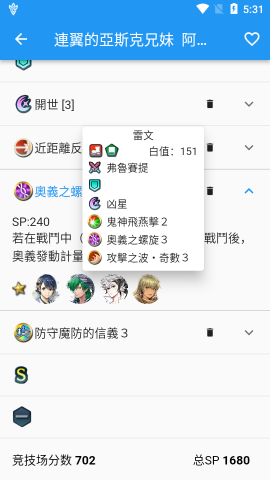
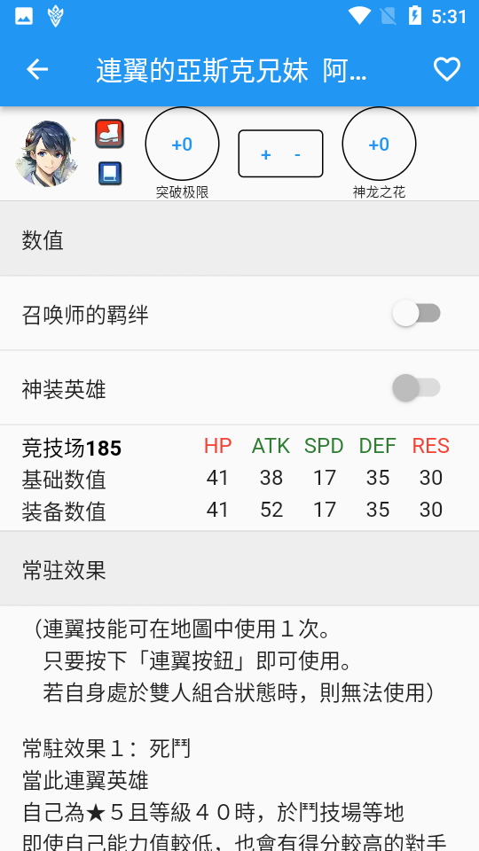
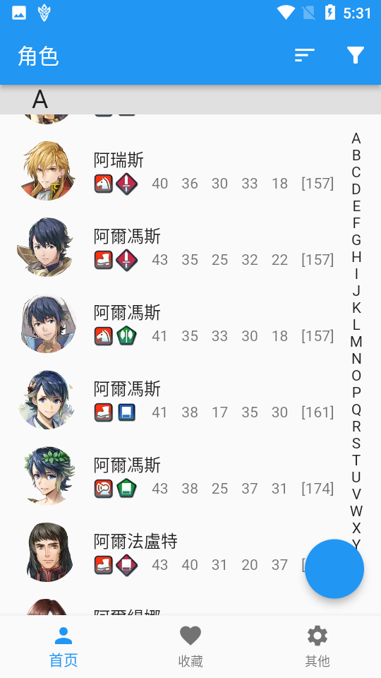
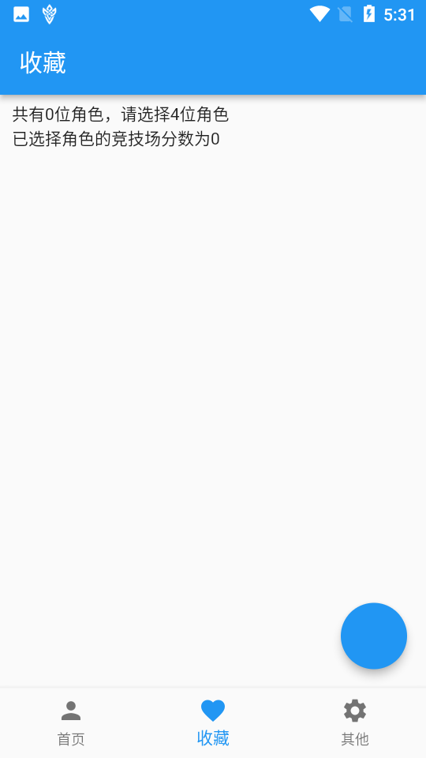
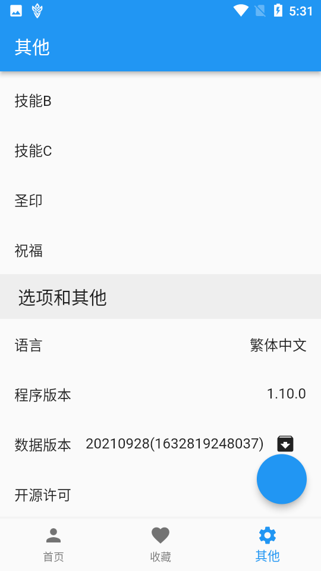
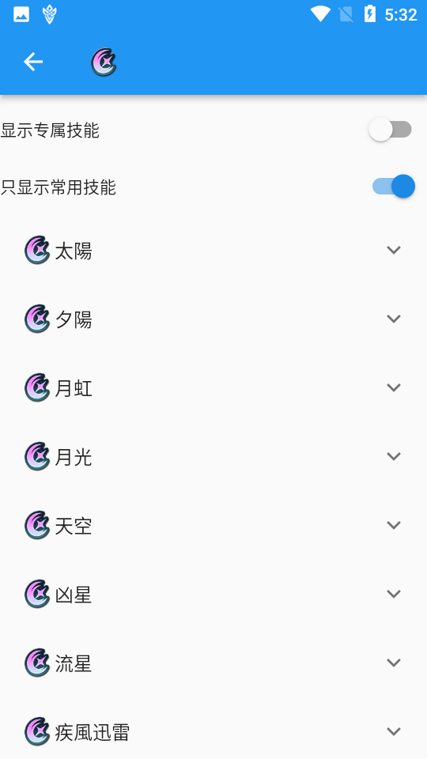

采用 flutter 复刻的 Fire Emblem Heroes 游戏数据查询工具 Builder for FEH ，发布于https://bbs.nga.cn/read.php?tid=28206759

数据来源：[GitHub - HertzDevil/feh-assets-json: JSON dumps of Fire Emblem Heroes asset files](https://github.com/HertzDevil/feh-assets-json)

资源文件来源：游戏文件 和 [Feh | Fire Emblem Wiki | Fandom](https://fireemblem.fandom.com/wiki/Feh)

属性算法来源：[Feh | Fire Emblem Wiki | Fandom](https://fireemblem.fandom.com/wiki/Feh)

flutter 版本：2.5.1（理论支持 2.2 到 2.5.1，但是大版本升级存在一些破环性更新，建议使用最新的版本）

使用说明：

安装配置 flutter

**PC 端**

1. 解压 assets/assets.zip 到 assets/
2. 自行生成一对 RSA 密钥，公钥放在 assets\update.pub，开发必须，仅运行的话生成一个空文件即可
3. flutter pub get
4. 编译运行

**安卓端**

1. 自行生成一对 RSA 密钥，公钥放在 assets\update.pub，开发必须，仅运行的话生成一个空文件即可
2. flutter pub get
3. 编译运行

备注：github 仅作为代码开源仓库，不会随时更新。

截图：

MIT License

Copyright (c) <2021> <copyright srew33@gmail.com>

Permission is hereby granted, free of charge, to any person obtaining a copy of this software and associated documentation files (the "Software"), to deal in the Software without restriction, including without limitation the rights to use, copy, modify, merge, publish, distribute, sublicense, and/or sell copies of the Software, and to permit persons to whom the Software is furnished to do so, subject to the following conditions:

The above copyright notice and this permission notice shall be included in all copies or substantial portions of the Software.

THE SOFTWARE IS PROVIDED "AS IS", WITHOUT WARRANTY OF ANY KIND, EXPRESS OR IMPLIED, INCLUDING BUT NOT LIMITED TO THE WARRANTIES OF MERCHANTABILITY, FITNESS FOR A PARTICULAR PURPOSE AND NONINFRINGEMENT. IN NO EVENT SHALL THE AUTHORS OR COPYRIGHT HOLDERS BE LIABLE FOR ANY CLAIM, DAMAGES OR OTHER LIABILITY, WHETHER IN AN ACTION OF CONTRACT, TORT OR OTHERWISE, ARISING FROM, OUT OF OR IN CONNECTION WITH THE SOFTWARE OR THE USE OR OTHER DEALINGS IN THE SOFTWARE.
